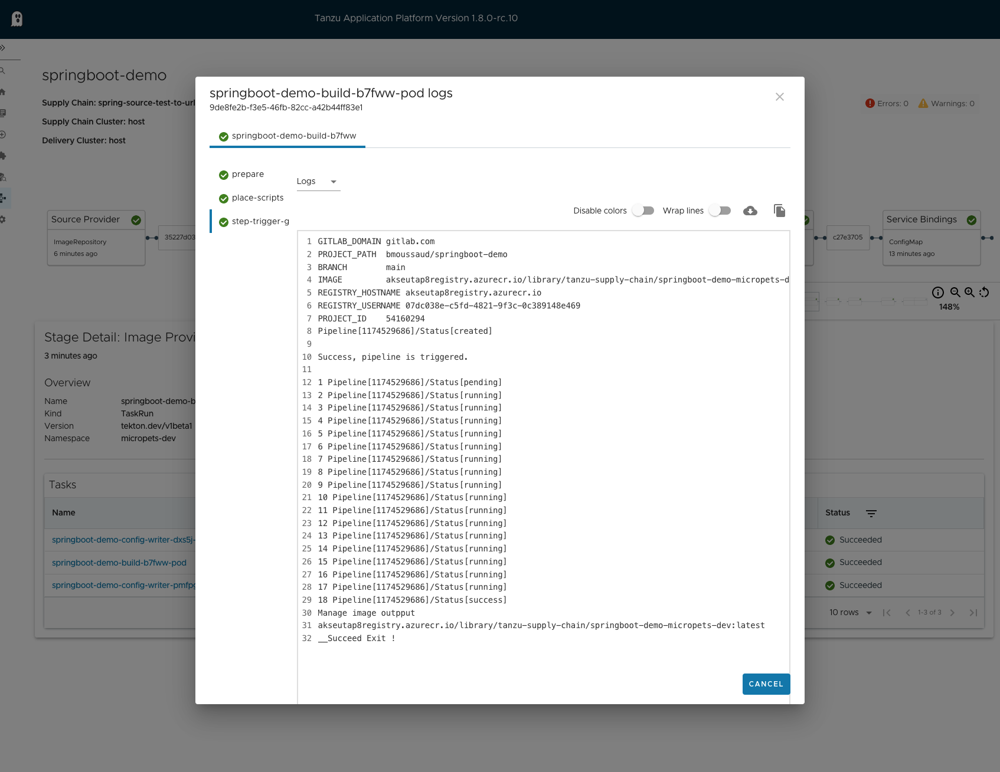

# TAP GitLab Trigger Pipeline

A tekton task to trigger a Gitlab pipeline and a Cartographer supply chain to use it the Tanzu Application platform 

# How to use it

1. `make apply` to build to task image and to trigger on a task run to use it
2. `make get logs`  to check the run and the logs
3. `make apply-supply-chain` to define the `spring-source-test-to-url` new supplychain 


To Run the `trigger-gitlab-pipeline`  Tekton tasks relies on 2 secrets:
``````
apiVersion: v1
kind: Secret
metadata:
  name: gitlab-token
  namespace: tap-tasks
type: Opaque
stringData:
  GITLAB_TOKEN: ${GITLAB_TOKEN}
  TRIGGER_TOKEN: ${TRIGGER_TOKEN}
---
apiVersion: v1
kind: Secret
metadata:
  name: registry-token
  namespace: tap-tasks
type: Opaque
stringData:
  REGISTRY_USERNAME: ${INSTALL_REGISTRY_USERNAME}
  REGISTRY_PASSWORD: ${INSTALL_REGISTRY_PASSWORD}
  REGISTRY_HOSTNAME: ${INSTALL_REGISTRY_HOSTNAME}
``````

The `spring-source-test-to-url` new supplychain is triggered if the associated workload has the `apps.tanzu.vmware.com/workload-type=springweb` label.
If the workload define the `gitlab_project` parameter the image will be built with GitLab pipeline else kpack is used.

Sample:
```
apiVersion: carto.run/v1alpha1
kind: Workload
metadata:
  name: springboot-demo
  labels:
    apps.tanzu.vmware.com/has-tests: "true"
    apps.tanzu.vmware.com/workload-type: springweb
    app.kubernetes.io/part-of: springboot-demo              <<<<<< HERE>>>>>>
spec:
  build:
    env:
      - name: BP_JVM_VERSION
        value: "17"
  source:
    git:
      url: https://gitlab.com/bmoussaud/springboot-demo
      ref:
        branch: main
  params:
    - name: testing_pipeline_matching_labels
      value:
        apps.tanzu.vmware.com/pipeline: skip-test
    - name: gitlab_project                                 <<<<<< HERE>>>>>>
      value: bmoussaud/springboot-demo
```

